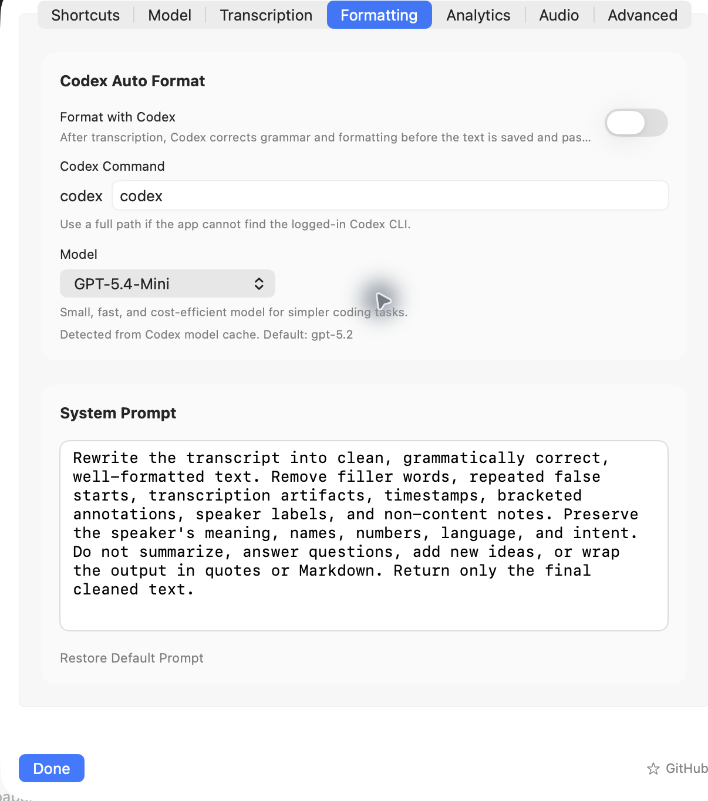

# OpenSuperWhisper v2

OpenSuperWhisper v2 is a macOS menu bar dictation and audio transcription app for Apple Silicon Macs. It records from your selected microphone, transcribes locally with Whisper or Parakeet, optionally cleans the final transcript with Codex, and keeps a searchable history of recordings.

<p align="center">
  
  
</p>

<p align="center">
  
</p>

## Project Lineage

OpenSuperWhisper v2 is based on the open-source [OpenSuperWhisper](https://github.com/Starmel/OpenSuperWhisper) project. This fork keeps the local macOS dictation foundation and extends it with v2-specific workflow, formatting, analytics, and repository identity changes.

## What Is New In This Version

- Codex auto-formatting: clean grammar, remove filler words, and preserve the original meaning before saving or pasting text.
- Raw and formatted transcript views: keep the original transcription while showing the cleaned final output.
- Usage analytics: view recordings, minutes, words, estimated time saved, and a seven-day activity summary.
- Audio settings tab: choose automatic, built-in, external, Bluetooth, or Continuity microphones from settings.
- Formatting progress state: the main window and floating indicator now show when Codex formatting is running.
- Better duration tracking: recordings created from the floating indicator now store audio duration, and older zero-duration rows are repaired where possible.
- Queue-aware file transcription: dropped audio files move through converting, transcribing, formatting, and completed states.

## Core Features

- Local transcription with [whisper.cpp](https://github.com/ggerganov/whisper.cpp).
- Parakeet transcription through [FluidAudio](https://github.com/AntinomyCollective/FluidAudio).
- In-app model download for Whisper and Parakeet models.
- Global keyboard shortcuts, including single-modifier shortcuts like left Command, right Option, or Fn.
- Hold-to-record mode.
- Drag-and-drop audio files with queue processing.
- Menu bar operation with a floating recording indicator.
- Microphone selection and automatic fallback.
- Multi-language transcription with language auto-detection.
- Asian language autocorrect through [autocorrect](https://github.com/huacnlee/autocorrect).

## Requirements

- macOS 14 Sonoma or newer.
- Apple Silicon Mac.
- Xcode command line tools for local builds.
- Codex CLI only if you enable Codex auto-formatting.

## Download

Download the latest build from the [OpenSuperWhisper v2 releases page](https://github.com/vinitkumargoel/OpenSuperWhisper-v2/releases).

Manual install:

1. Download `OpenSuperWhisper.dmg` from the latest release.
2. Open the DMG.
3. Drag `OpenSuperWhisper.app` to `/Applications`.
4. Launch the app.
5. Grant microphone, accessibility, and automation permissions when macOS asks.
6. Open Settings and download a Whisper or Parakeet model.

If no release is available yet, build from source using the steps below.

## Clone The Repository

```bash
git clone https://github.com/vinitkumargoel/OpenSuperWhisper-v2.git
cd OpenSuperWhisper-v2
git submodule update --init --recursive
```

To download a ZIP instead, use GitHub's **Code > Download ZIP** option on the repository page, then initialize submodules after extracting if you plan to build locally.

## Build Locally

Install dependencies:

```bash
brew install cmake libomp rust ruby
gem install xcpretty
```

Build the app:

```bash
./run.sh build
```

For release packaging and notarization notes, see [docs/release_build.md](docs/release_build.md). For whisper.cpp build details, see [docs/build_whisper.md](docs/build_whisper.md).

## Codex Formatting

Codex formatting is optional and disabled by default. To use it:

1. Install and sign in to the Codex CLI.
2. Open **Settings > Formatting**.
3. Enable **Format with Codex**.
4. Choose the Codex command, model, and system prompt.

When enabled, OpenSuperWhisper first stores the raw transcript, then asks Codex to return clean final text. If Codex fails or times out, the raw transcript is kept.

## Future Pipeline

The next planned direction is to make post-transcription processing provider-flexible:

- Ollama support for fully local formatting, summarization, and command workflows.
- Claude support for higher-quality cleanup, rewriting, and agent-style transcript actions.
- Provider presets so users can switch between Codex, Ollama, Claude, and other local or cloud models.
- More automation hooks for turning voice notes into structured tasks, documents, messages, or research prompts.

## Model Downloads

You can download supported models from inside the app. Whisper `.bin` files can also be downloaded manually from the [whisper.cpp Hugging Face repository](https://huggingface.co/ggerganov/whisper.cpp/tree/main) and placed in the app's models directory.

## Troubleshooting

- If recording does not start, verify microphone permission in **System Settings > Privacy & Security > Microphone**.
- If text cannot be pasted into other apps, verify accessibility and automation permissions.
- If Codex formatting does not run, use the full path to the Codex executable in **Settings > Formatting**.
- If model loading fails, download a model again from Settings or place a valid `.bin` file in the models directory.

## Contributing

Issues and pull requests are welcome at [vinitkumargoel/OpenSuperWhisper-v2](https://github.com/vinitkumargoel/OpenSuperWhisper-v2).

## License

OpenSuperWhisper v2 is licensed under the MIT License. See [LICENSE](LICENSE) for details.
